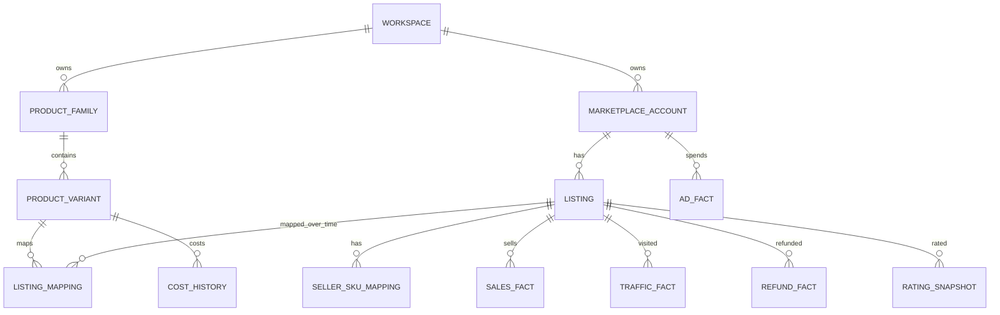
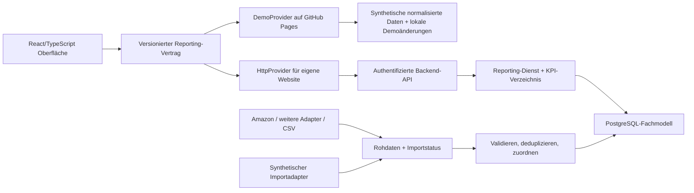

# Marketplace BI — Produktplan

Stand: 02.10.2026 · Planungsstand, keine Behauptung bereits implementierter Funktionen.

## 1. Ziel und Leitentscheidung

Ein internes BI-Produkt für historische Marketplace-Daten: Geschäftsentwicklung verstehen, Zeiträume vergleichen, von der Gesamtansicht bis zum Produkt bzw. Listing navigieren und wiederverwendbare Reports erstellen. Amazon zuerst; weitere Marktplätze werden in dasselbe Produktmodell integriert.

Sellerboard ist eine funktionale Referenz für Profitabilitäts- und Marketplace-Reporting, kein Auftrag zu einem identischen UI oder zur Übernahme aller operativen Module. Ausschlaggebend sind unsere Analysefragen. Unternehmensbewertung, Verkaufsvermittlung, Repricing, Kampagnensteuerung und Einkaufsautomatisierung gehören nicht zum Kern.

**Die Demo wird als echte erste Produktversion gebaut.** Navigation, Filter, Tabellen, Kennzahlendefinitionen, Drilldowns und Reports sollen bestehen bleiben, wenn echte Quellen hinzukommen. Demo und Produktionsbetrieb nutzen dieselben versionierten Abfrageverträge. APIs werden schrittweise als Datenquellen ergänzt. Eine fertige Demo allein beweist jedoch weder die Verfügbarkeit der Quelldaten noch die Produktionsreife von Import, Login und Betrieb.

## 2. Was bereits existiert — und was noch fehlt

Vorhanden: statische Amazon-DE-Demo, 18 synthetische Listings auf bestätigten Clouvou-Stuhlvarianten, 15 benannte Modelle im Produktstamm und Marken-/Kategoriefilter, Produkt-/SKU-Modell, lokale SQLite-Grundlage, Verkauf/Traffic/Erstattungen/Werbekosten, einzelne Produktfilter und Listing-Details, automatisierte Tests und GitHub-Pages-Veröffentlichung.

Noch nicht vorhanden: echtes Reporting über mehrere Marktplätze, größere Historie, frei wählbare Vergleichszeiträume, Trends, Kostenrechnung, editierbarer Produktstamm, gespeicherte Reports, Importpipeline, Backend-API, Login und echte Marketplace-Verbindungen.

Wiederverwenden: fachliche Zuordnung Produkt → Listing → SKU, bisherige Demo-Kennzahlen, Geldwerte ohne Gleitkomma-Rundungsfehler, Trennung nicht zuordenbarer Werbung, Tests und Veröffentlichungsablauf. Weiterentwickeln: gegenwärtige Ein-Datei-Oberfläche, fest eingebundener JSON-Snapshot und SQLite-Demoexport. Diese sind ein Prototyp, noch nicht die endgültige Architektur.

## 3. Sellerboard-Recherche und Evidenzstand

Ergänzung: Eine erste Recherche öffentlich zugänglicher Drittquellen liegt in [SELLERBOARD_RESEARCH.md](SELLERBOARD_RESEARCH.md) vor. Sie trennt gelesene Nutzerberichte und schwache Claims von weiter ungeprüften Herstellerfunktionen. Der folgende Absatz beschreibt die ursprüngliche Einschränkung beim Herstellerzugriff.

Die öffentliche Herstellerseite `https://sellerboard.com/` und der Pfad `https://sellerboard.com/features/` wurden am 02.10.2026 angefragt. Beide Abrufe scheiterten an der Cloud-Netzwerkregel (Proxy CONNECT 403). Deshalb liegen **noch keine verifizierten aktuellen Seiteninhalte** vor. Der Features-Pfad ist ein Rechercheversuch, keine bestätigte Inhaltsquelle. Die Domains `sellerboard.com` und `www.sellerboard.com` wurden als Ergänzung im Konfigurationsentwurf gespeichert; die bisherigen Regeln bleiben erhalten.

Die folgende Tabelle ist unsere **Anforderungsauswahl**, kein behauptetes vollständiges oder aktuell geprüftes Sellerboard-Funktionsinventar. Nach Freigabe der Herstellerseite werden tatsächliche Funktionen und Links ergänzt. Keine Produktentscheidung hängt von einer nicht geprüften Behauptung über Sellerboard ab.

| Zu recherchierender Referenzbereich | Entscheidung für unser Produkt | Begründung |
| --- | --- | --- |
| Umsatz-/Profit-Dashboard und P&L | Kern | Historische Entwicklung und Kostentreiber verstehen |
| Produkt-, Varianten- und Marketplace-Analyse | Kern | Zentrale fachliche Sicht über alle Kanäle |
| Zeitvergleiche, Trends und detaillierte Tabellen | Kern | Veränderungen erkennen und erklären |
| PPC-/Werbe-Reporting | Kern | Kosten, Effizienz und Zuordnungsqualität verstehen |
| Erstattungen, Gebühren und weitere Kosten | Kern | Wirtschaftlichkeit richtig einordnen |
| Kostenpflege und Import/Export | Kern als Datenpflege | Ohne nachvollziehbare Kostenbasis ist Gewinn irreführend |
| Bestandsdaten | Spätere analytische Ergänzung | Out-of-stock als Erklärung für historische Umsatzänderungen |
| Cashflow/Auszahlungen | Spätere getrennte Analyse | Kontobewegungen sind nicht gleich Umsatz oder Gewinn |
| Warnungen | Später nur Datenqualität/Analyse | Kein operatives Steuerungssystem im ersten Umfang |
| Bestandsnachbestellung, Review-E-Mails, Erstattungsanträge | Außerhalb Kern | Operative Prozesse statt Reporting |
| Automatische Werbeoptimierung, Repricing | Ausgeschlossen | Keine Schreibaktionen auf Marktplätzen |
| Unternehmensbewertung/Business-Verkauf | Ausgeschlossen | Vom Nutzer ausdrücklich nicht gewünscht |

Nachrecherche: Hersteller-Navigation, dokumentierte Dashboard-Dimensionen, Kosten-/Profitdefinitionen, Zeitraumvergleich, Exportmöglichkeiten, PPC-Zuordnung und Grenzen der Datenverfügbarkeit. Jede übernommene Aussage erhält URL, Abrufdatum und eigene Produktentscheidung. Produktwerbung gilt nicht als Nachweis einer API-Verfügbarkeit.

## 4. Die erste vollständige Demo

Die Demo beantwortet diese sieben Fragen durch tatsächlich bedienbare Ansichten:

1. Wie haben sich Umsatz, Absatz, Erstattungen und Ergebnis entwickelt?
2. Welche Produkte, Varianten, ASINs und Marktplätze erklären die Veränderung?
3. Kommt eine Umsatzänderung aus Einheiten, Verkaufspreis, Traffic oder Conversion?
4. Wie viel Werbung bezahlen wir, wie effizient ist sie, und welche Kosten sind nicht zuordenbar?
5. Welche Gebühren, Einkaufskosten und Erstattungen beeinflussen den Deckungsbeitrag?
6. Welche Daten fehlen, sind verspätet oder nur geschätzt?
7. Wie speichere und exportiere ich genau diese Auswertung für den nächsten Bericht?

### Navigation und Funktionsumfang

| Bereich | Inhalt der fertigen Demo | Wichtige Interaktionen |
| --- | --- | --- |
| Übersicht | KPI-Leiste, Zeitreihen, Periodenvergleich, Umsatz-/Ergebnisbrücke, größte positive/negative Beiträge | Zeitraum/Granularität ändern, KPI wählen, vom Beitrag zum Produkt wechseln |
| Produkte | kanalübergreifende Tabelle nach Produktfamilie oder verkaufbarer Variante | suchen, sortieren, filtern, gruppieren, Spalten wählen, exportieren |
| Produktdetail | Zeitreihe, zugehörige Listings/SKUs, Kanalvergleich, Kosten, Traffic, Werbung, Erstattungen | Produkt → Variante → Listing; Kontext und Vergleichszeitraum beibehalten |
| Marktplätze | Konten/Länder/Kanäle im Vergleich | verfügbare Kennzahlen und Abdeckung sichtbar; kein erzwungener CVR-Vergleich |
| Werbung | Kosten nach Typ/Kampagne/Produkt, Klicks, Impressionen, zugeordnete Sales/Umsätze, ACoS/ROAS/TACoS | Attributionsfenster sehen; kontoweite, zugeordnete und nicht zuordenbare Kosten trennen |
| Erstattungen | Beträge, Einheiten, Raten, zeitliche Entwicklung; Gründe, sofern geliefert | Ereignisdatum vs. spätere optionale Bestellkohorte unterscheiden |
| Ergebnis & Kosten | Erlös-/Kosten-Wasserfall, COGS, Gebühren, Fulfillment, Werbung, weitere Kosten | Berechnungsdefinition und fehlende/geschätzte Kosten öffnen |
| Reports | gespeicherte Filter/Spalten/Sortierung/Vergleiche, CSV-Export, druckbare Ansicht | Report benennen, wieder öffnen, duplizieren, exportieren |
| Daten & Produktstamm | Produkt-/Variantenpflege, SKU-Zuordnung, Kostenzeiträume, CSV-Importvorschau, Quellen-/Syncstatus | Konflikte bearbeiten, unzugeordnete Datensätze sehen, Demoänderungen zurücksetzen |

Die Datenpflege gehört zur Analysegrundlage. Aufträge, Listings oder Kampagnen werden damit nicht auf Amazon geändert. Frei arrangierbare Widget-Dashboards, Excel-Spezialformatierungen, automatische E-Mail-Reports und öffentliche Freigabelinks sind spätere Erweiterungen, keine Voraussetzung für die erste vollständige Demo.

### Gemeinsame Bedienregeln

- Globale Filter: freier Zeitraum, vorherige gleich lange Periode, Vorjahresvergleich oder eigener Vergleich; Konto, Marktplatz/Land, Produktfamilie, Variante und Tags.
- Zeitreihen: Tag/Woche/Monat, absolute und relative Veränderung; Prozentpunkte bei Quoten. Division durch null bleibt nicht berechenbar.
- Unterjährige/offene Perioden werden als unvollständig gekennzeichnet. Vergleiche nutzen explizit dieselbe Anzahl abgeschlossener Tage oder weisen die Abweichung aus.
- Filterkontext bleibt bei Navigation und Drilldown erhalten und ist über URL/Reportdefinition reproduzierbar. Keine Zugangsdaten oder personenbezogenen Rohdaten in URLs.
- Tabellen: stabile Sortierung, Pagination, passende Zahlenausrichtung, feste Identifikationsspalte; Gesamtzeilen berücksichtigen den gefilterten Datensatz, nicht nur die aktuelle Seite.
- Jede KPI zeigt Definition, Einheit, Zeitbezug und Datenabdeckung. Null, nicht verfügbar, nicht unterstützt, geschätzt und noch nicht synchronisiert sind unterschiedliche Zustände.
- Lade-, Leer-, Fehler- und Teilzustände werden als reguläre Produktansichten gestaltet. Keine leeren Schaltflächen ohne Funktion.
- Responsive Bedienung und Tastaturnavigation; dichte Tabellen dürfen innerhalb ihres Bereichs horizontal scrollen.

## 5. Der Produktstamm als fachliches Fundament

Die erste bestätigte Sortimentsdefinition steht in [PRODUCT_CATALOG.md](PRODUCT_CATALOG.md), maschinenlesbar in [catalog/assortment.json](../catalog/assortment.json). Marken: Clouvou, Lutivo und Wintoncove; 15 benannte Modelle, fünf weitere unbenannte Bürostuhlmodelle und 18 bestätigte Clouvou-Bürostuhl-Farbvarianten. Fehlende Varianten bleiben ausdrücklich offen.

Eine einzelne Tabelle mit Produktname und ASIN reicht nicht. Wir trennen interne Identität und externe Verkaufsidentität:

- **Produktfamilie:** gemeinsame kaufmännische Sicht, beispielsweise „Bright Seat“.
- **Verkaufbare Variante:** dauerhaft eindeutige interne SKU, z. B. Schwarz. Einzelne Varianten besitzen eigene Kosten und externe Zuordnungen. Die interne SKU ist kein Amazon-Schlüssel.
- **Listing:** externe Verkaufsidentität im jeweiligen Marketplace-/Konto-/Länderkontext; bei Amazon grundsätzlich Child-ASIN. Parent-ASIN als Beziehung, nicht als zusätzliche summierbare Verkaufszeile.
- **Seller-SKU-Zuordnung:** externe Seller-SKU mit Gültigkeitszeitraum und Fulfillment-Kontext. Mehrere SKUs einer ASIN vervielfachen keine ASIN-Metriken.
- **Historische Zuordnung:** Varianten-/SKU-Mapping und Kosten gelten ab/bis Datum. Änderung heute darf historische Zahlen nicht unbemerkt umdeuten. Korrekturen werden protokolliert und lösen gezielte Neuberechnung aus.
- **Unbekannte Produkte:** bleiben als unzugeordnet sichtbar und fehlen nicht stillschweigend in Kontosummen. Kein automatisches Zusammenführen nach ähnlichem Namen.
- **Bundles:** später eigene verkaufbare SKU mit versionierter Komponentenliste. Komponenten dienen zunächst Kosten-/Bestandslogik; Verkaufsumsatz wird ohne explizite Methode nicht mehrfach auf Komponenten verteilt.
- **Mandant/Workspace:** von Anfang an Teil aller fachlichen Schlüssel und Abfragegrenzen, auch wenn zunächst nur die eigene Firma arbeitet.

Beispiel: Produktfamilie Bright Seat → Variante Schwarz → Amazon DE Child-ASIN mit FBA- und FBM-SKU sowie später ein Listing desselben Artikels auf einem anderen Marktplatz. Einheiten über Kanäle lassen sich addieren; Sessions und Conversion werden nur im definierten vergleichbaren Kontext aggregiert.

## 6. Fakten statt einer universellen KPI-Tabelle

| Datensatz | Natürliche Granularität | Besonderheiten |
| --- | --- | --- |
| Verkaufsposition | Quelle/Konto/Bestellposition oder klar bezeichnete Tagesaggregate | keine parallele Addition von Bestell- und bereits enthaltenen Berichtssummen |
| Traffic | Quelle/Konto/Listing/Tag | Sessions/Pageviews getrennt, Definition je Quelle |
| Erstattungsereignis | Quelle/Erstattungsposition/Ereignisdatum | optionaler Bestellbezug; Teil-/Mehrfacherstattungen und Korrekturen |
| Gebühren/Kostenereignis | Quelle/Transaktion/Kostenart | Verkaufsgebühren, Fulfillment, Lagerkosten usw.; Konto- und Produktkosten getrennt |
| Werbeleistung | Quelle/Konto/Tag/Berichtsebene/Kampagne/Werbetyp | Attribution, Fenster, Reportversion und Zuordnungsniveau speichern |
| Werbezuordnung | normalisierte Kostenzeile → Listing/Variante oder unzugeordnet | keine Verdopplung von Kampagnensummen durch ASIN-Reports |
| Bewertung | Listing oder explizite Parent-Gruppe/Stichtag | Snapshot, keine Tagesbewegung; Anzahl und verfügbare Quelle |
| Einkaufskosten | Variante/Gültigkeitsintervall/Währung | Kostenänderungen wirken zeitbezogen |
| Weitere Kosten | Workspace/Konto/Kostenart/Zeitraum | direkte Zuordnung oder transparent ausgewiesene Kontokosten |
| FX-Kurse | Währungspaar/Datum/Kurstyp/Quelle | Originalwährung erhalten; Berichtswährung mit dokumentiertem Kurs |
| Importlauf/Rohdaten | Quelle/Konto/Lauf/Schema-/Quellversion | Status, Zeitstempel, Prüfsummen, Replays und Fehlernachweise |

Rohdaten bzw. reproduzierbare Importartefakte bleiben vom bereinigten Fachmodell getrennt. Quellenkorrekturen, Stornos, Backfills und verspätete Erstattungen sind normale Fälle. Wiederholung eines Imports darf keine Doppelzählung erzeugen. Konsolidierung braucht dokumentierte Vorrangregeln, wenn zwei Berichte dieselben wirtschaftlichen Ereignisse beschreiben.

## 7. Kennzahlenvertrag

Ein versioniertes KPI-Verzeichnis definiert Formel, Einheit, Granularität, Aggregation, Zeitbezug, Voraussetzungen und Verfügbarkeit. Frontend-Komponenten enthalten keine unabhängigen Gewinn- oder Quotenformeln.

- **Umsatz:** Brutto-Bestellwert und Nettoerlös ohne Umsatzsteuer getrennt führen. Rabatte, Versand, Steuer und Erstattungen bekommen eindeutige Vorzeichen und eigene Definitionen. Keine unbestimmte Spalte „Gewinn“.
- **Sales:** Einheiten. Bestellanzahl separat; über Produktzeilen sind Bestellungen nicht ohne Deduplizierung additiv.
- **Conversion:** bei Amazon Einheiten/Sessions als Unit Session Percentage; alternative Order-CVR nur bei geeigneten Daten. Unterschiedliche Marketplace-Definitionen nicht als gleichwertig behandeln.
- **Erstattungsrate:** primär periodische erstattete/verkaufte Einheiten, deutlich so beschriftet. Eine spätere kohortenbasierte Rate ist eine andere Kennzahl und benötigt Bestellbezug sowie Reifezeit.
- **Ergebnis:** Nettoerlös nach Erstattungen minus definierte zuordenbare Gebühren, Warenkosten, Fulfillment und Werbung ergibt den entsprechend benannten Deckungsbeitrag. Gemeinkosten/weitere Kosten als gesonderte Ergebnisstufe. Unbekannte Kosten verhindern einen vermeintlich vollständigen Nettogewinn; bekannte Teilbeträge dürfen als unvollständig angezeigt werden.
- **COGS:** Kostenstand zur Verkaufsposition; Erstattungen führen nicht automatisch zu einer vollständigen Warenkosten-Rückbuchung. Wiederverkaufbarkeit/Rückerhalt und Gebührenrückerstattung sind eigene Informationen.
- **Werbung:** ACoS = Ausgaben/zugeordneter Werbeumsatz; ROAS umgekehrt; TACoS = Werbeausgaben/vergleichbarer Gesamtumsatz. Zähler/Nenner müssen bezüglich Zeitraum, Währung und Zuordnung zueinander passen.
- **Werbe-Sales:** Attributionsfenster und Berichtstyp immer sichtbar. Nicht pauschal Gesamt-Sales minus Ads-Sales als „organisch“ ausgeben. Cross-SKU-/Halo-Auswertungen bleiben zunächst aus dem Umfang.
- **Bewertungen:** letzter zulässiger Stand bis Periodenende; keine Addition und kein ungewichteter Durchschnitt über ASINs. Gemeinsame Parent-Bewertungen nicht als unabhängige Child-Bewertungen behandeln.
- **Bestand:** falls später ergänzt, Stichtagswert; nicht über Tage summieren. Dasselbe gilt für Cash-/Kontostände.
- **Währung/Zeit:** Originalbeträge und Zeitzone erhalten. Berichtswährungsumrechnung und Periodengrenzen explizit; Summenquotienten statt Mittelwerten von Tagesquoten. Datumsvergleich umfasst Schaltjahre, Sommerzeit und unvollständige Tage.
- **Unzugeordnete Werte:** bleiben auf ihrer bekannten Kontoebene. Direkt zuordenbarer Produktdeckungsbeitrag und vollständiges Kontoergebnis werden getrennt dargestellt.
- **Abdeckung:** bekannte Teilsumme plus Abdeckungsstatus statt erfundener Null. KPI-Karten müssen bei Lücken als unvollständig erkennbar sein; Vergleichsdeltas werden bei nicht vergleichbarer Abdeckung unterdrückt oder ausdrücklich eingeschränkt.

## 8. Architektur: Demo und echte Daten durch dieselbe Produktschnittstelle

### Konkrete technische Entscheidung

- **Frontend:** React + TypeScript auf Vite, typisierte Tabellen-/Filterkomponenten und ein gemeinsamer Zustand für Query/Report. Die wachsende Ein-Datei-DOM-Implementierung wird schrittweise ersetzt. Vorhandene Styles und brauchbare Fachlogik bleiben erhalten.
- **Vertrag:** `ReportingClient` mit versionierten Requests/Responses und Laufzeitvalidierung, z. B. Zod. Mindestens Overview, ProductTable, ProductDetail, Advertising, Refunds, Profitability, Catalog, SavedReports und DataHealth.
- **Demo:** `DemoProvider` erfüllt exakt diese Methoden; unterstützt deterministische Daten, Lade-/Fehlerszenarien und lokal gespeicherte Änderungen. IndexedDB speichert nur Demo-Reports/Mapping-Änderungen; sichtbarer Reset und Hinweis „nur in diesem Browser“. Keine Behauptung von Team-Synchronisierung oder sicherem Login auf Pages.
- **Gemeinsame Regeln:** DTOs, KPI-Metadaten und pure fachliche Berechnungen in einem gemeinsamen TypeScript-Paket. Serveraggregation darf SQL verwenden, muss aber dieselben Referenzergebnisse liefern. Golden Datasets prüfen Demo- und HTTP-Provider auf identische Ergebnisse.
- **Backend-Ziel:** Node.js/TypeScript als modularer Monolith, PostgreSQL, versionierte Migrationen und separater Import-Worker. Keine Microservice-Landschaft für die erste Version.
- **Jobs:** zunächst PostgreSQL-gestützte Jobqueue mit Retry, Backoff, Sperren und nachvollziehbarem Fehlerstatus; keine zusätzliche Redis-Abhängigkeit ohne Bedarf.
- **Rohdaten:** privater Objektspeicher bei größeren Quellreports; Metadaten/Prüfsummen in PostgreSQL. Aufbewahrung und Löschregeln vor Realbetrieb festlegen.
- **Authentifizierung:** erprobter OIDC-/Session-Anbieter; Backend autorisiert Workspace-Mitgliedschaft pro Request. Rollen zunächst Admin, Analyst, Viewer. UI-Rollensimulation in der Demo ist kein Zugriffsschutz.
- **Deployment:** bestehende GitHub Pages für die synthetische Demo. Später dieselbe Frontend-App unter eigener Domain mit Backend-Route `/api`, HTTPS und serverseitigen Sessions. Nur öffentliche Konfiguration im Frontend; Marketplace-Tokens ausschließlich serverseitig.
- **SQLite:** aktuelles Prototyp-/Fixture-Werkzeug. PostgreSQL wird vor echten API-Verbindungen mit synthetischen Daten erprobt. Kein stilles Kopieren einer SQLite-Datei als Produktionsmigration.

### Abfragevertrag — verbindliche Eigenschaften

Request enthält Version, Zeitraum, Vergleich, Zeitzone, Granularität, Berichtswährung, Filter, Gruppierung, Sortierung und Pagination. Response enthält Dimensionen, Kennzahlen, Summen, Vergleichswerte und Metadaten zu Datenstand, Quellen, Abdeckung, Schätzungen, Attributionsfenstern und Warnungen. Große Tabellen werden serverseitig paginiert; Konto-Totals sind keine Summe nur der sichtbaren Seite.

Persistierte Reports speichern eine versionierte Query-/Darstellungsdefinition, keine endlosen Datenkopien. Reproduzierbare Exporte enthalten Filter, Zeitraum, Währung, Datenstand und Definitionsversion. CSV-Exports berücksichtigen Formel-Injection bei textuellen Feldern, Zahlenformate und nicht verfügbare Werte.

## 9. Demo-Daten, die echte Probleme vorwegnehmen

Zielbestand: deterministische 24 Monate, mindestens 100 verkaufbare Varianten in 30 Produktfamilien, mehrere Amazon-Länderkonten und ein klar als synthetisch markierter zweiter Marketplace. Dessen reale Integration wird erst gewählt, wenn die tatsächlichen Vertriebskanäle feststehen. Er dient schon vorher zum Test der kanalübergreifenden Architektur, ohne eine bestimmte externe API zu versprechen.

Enthaltene Szenarien: Saisonspitzen, Launches, Preisänderungen, Traffic- und Conversion-Rückgänge, Varianten, mehrere Seller-SKUs, unzugeordnete Produkte, fehlende Traffic-Daten eines Kanals, Nullverkäufe, verspätete Erstattungen, Kostenänderungen, verschiedene Währungen, Werbekosten ohne Produktbezug, veränderte Bewertungsstände und korrigierte Quellberichte.

Nicht alle Kanäle liefern jede KPI. Die Demo muss diese Einschränkung sichtbar machen, statt eine unrealistisch perfekte Datentabelle zu simulieren. Ein größerer deterministischer Datensatz dient zusätzlich als Performancetest. Zeiten werden auf einer dokumentierten Referenzumgebung gemessen, nicht als ungeprüfte Zusage angegeben.

## 10. Bauphasen mit verbindlichen Abnahmen

| Phase | Ergebnis | Abnahme, bevor die nächste Phase beginnt |
| --- | --- | --- |
| 0 — Definitionen & Evidenz | KPI-Verzeichnis, geprüfte Referenzanalyse, Produkt-/Variantenmodell, Query-Vertrag, Demo-Szenarien | zentrale Analysefragen und Kennzahlengrenzen dokumentiert; Sellerboard-Nachrecherche separat als offen markiert, falls Zugriff weiter blockiert |
| 1 — Fundament | TypeScript/React-Struktur, normalisierte Demo, Provider-Vertrag, Katalog-/Kostenhistorie, URL-Filter, automatisierte Modelltests | gleiche Filter/Queries liefern deterministische Ergebnisse; keine Doppelzählung durch SKU/Parent/Bundle; Quoten/fehlende Werte/Währung getestet |
| 2 — Amazon Reporting | Übersicht, Produkt-/ASIN-Tabellen und Detailansichten, Zeitreihen, echte Periodenvergleiche, Erstattungen und Kosten-/Ergebnisansicht | Übersichtssummen stimmen mit Drilldowns überein; Vergleich, Umsatz-/Kostenbrücke und Export sind nachvollziehbar |
| 3 — Werbung & mehrere Kanäle | Werbeanalyse, nicht zuordenbare Kosten, Kanal-/Ländervergleich, zweite synthetische Quelle | Kostenabgleich geht auf; nicht unterstützte Metriken sichtbar; keine Mischung von Währungen/Attributionsfenstern |
| 4 — Reporting als fertiges Produkt | gespeicherte Reports, CSV/Print, produktive Bedienung der Demo-Datenpflege, Datengesundheit, Fehler-/Leerzustände, responsive UI | alle sieben Analysefragen in vollständigen Nutzerabläufen beantwortbar; Reports reproduzierbar; keine Platzhalter-Buttons |
| 5 — Produktionsgerüst mit Demodaten | eigene Staging-Website, PostgreSQL, Backend/Worker, echtes Login/Rollen, Migrationen, synthetischer Importadapter, Backups | dieselben Vertrags-/UI-Tests bestehen über HTTP; unberechtigte/mandantenfremde Abfragen scheitern; Wiederherstellung und Import-Replay geprüft |
| 6 — Echte Quellen schrittweise | Amazon Verkauf/Traffic → Gebühren/Erstattungen → Ads → weitere genehmigte Quellen/Marktplätze | je Quelle historischer Import, Abgleich mit Referenzberichten, Korrekturen/Retry/Deduplizierung, Monitoring und Datenschutz geprüft |

Die Direktanbindungs-Vorbereitung wurde auf ausdrücklichen Nutzerwunsch vorgezogen; siehe den folgenden Stand und `docs/api/README.md`. Phase 0/1 bleibt für das vollständige Produktfundament offen. Keine weiteren isolierten Dashboard-Kacheln vor dem Fundament. Jede Phase erhält im Repository eine kurze Abnahmeliste und ein Demo-Release. Neue Wünsche werden zunächst einem Bereich und einer Phase zugeordnet; sie unterbrechen keinen laufenden Block ohne bewusste Prioritätsänderung.

### Definition „Demo fertig“

Phasen 1–4 sind funktional abgeschlossen. Die vollständigen Nutzerabläufe laufen mit realistischen Daten und demselben Reporting-Vertrag, der später über HTTP bedient wird. Die Tests prüfen auch Lücken, Retouren, Währungen und fehlerhafte Zuordnungen. UI und Reportdefinitionen müssen beim Wechsel auf den HTTP-Provider unverändert funktionieren.

### Definition „bereit für echte Daten“

Zusätzlich ist Phase 5 abgeschlossen. Login, Berechtigungen, persistente Daten, Importbetrieb und Hosting sind mit synthetischen Daten wirklich getestet. Erst dann werden echte Tokens und Seller-Daten ergänzt. Bei API-Abweichungen dürfen Adapter/Normalisierung erweitert werden; Kennzahlen dürfen nicht stillschweigend ihre Bedeutung ändern.

## 11. Echte Integrationen: spätere Lieferung, frühe Machbarkeitsprüfung

Keine Kontoverbindung nötig, um die Demo auszubauen. Parallel zu den fachlichen Datenverträgen müssen offizielle API-/Berichtsdefinitionen geprüft werden, bevor bestimmte Real-World-KPIs als garantiert gelten. Credentials kommen erst für einen konkreten Integrationsschritt hinzu.

1. **Amazon Verkauf/Traffic und Katalog:** verfügbare SP-API-/Berichtsquellen, Historienfenster, Child-ASIN/SKU-Bezug und Datumsdefinitionen prüfen. Produktmapping importieren und Konflikte vor der Freigabe zeigen.
2. **Erstattungen/Gebühren/Finanzen:** Transaktionsbezug und Zeitbasis unabhängig vom Sales-Report validieren. Auszahlungen nicht mit Umsatz gleichsetzen.
3. **Amazon Ads:** gesonderte Berechtigungen und Berichtstypen; SP/SB/SD und gegebenenfalls TV mit ihren tatsächlichen Dimensionen. Unzuordenbare Ausgaben bleiben unzugeordnet.
4. **Bewertungen:** geeignete zulässige Quelle erst nach Verfügbarkeitsprüfung wählen. Keine pauschale Zusage, dass vollständige historische Bewertungen über SP-API verfügbar sind.
5. **Weitere Marktplätze:** anhand tatsächlicher Vertriebskanäle priorisieren. Gleiche Import-/Reporting-Verträge, aber eigene Capability-Matrix statt erfundener Gleichheit aller Metriken.

Vor Produktivstart: verfügbare Vergangenheit je Quelle, Rate Limits, Berichtsverzögerung, Steuerbasis, Datenlöschung und Amazon-Nutzungsbedingungen klären. Wo Historie nicht abrufbar ist, bleibt sie fehlend oder wird aus zulässigen Bestandsreports importiert. CSV ist ein ergänzender Adapter, kein Grund für eine zweite Kennzahlenlogik.

## 12. Risiken und bewusste Grenzen

- „Nur API austauschen“ gilt für die Produktschnittstelle, nicht für die Integrationsarbeit. Quellenabgleich, Berechtigungen, Backfills und Betrieb bleiben echte Arbeitspakete.
- Eine vollwertige Login-Website lässt sich nicht allein durch einen Login-Bildschirm auf GitHub Pages herstellen. Produktionsgerüst vor echten Daten separat nachweisen.
- Profitabilität ist nur so vollständig wie Gebühren, Einkaufskosten, Steuer-/FX-Regeln und Erstattungsbehandlung. Fehlende Kosten sichtbar lassen.
- Manche Werbe- und Bewertungsdaten bleiben auf Konto-/Kampagnen-/Parent-Ebene. Keine fingierte ASIN-Zuordnung.
- Datenkorrekturen können historische Reports ändern. Datenstand, Definitionsversion und Änderungshistorie müssen dies nachvollziehbar machen.
- Die bisherige öffentliche Demo bleibt ausschließlich synthetisch. Echte Seller-Daten gehören nicht in Git, statische öffentliche Bundles oder öffentlich erreichbare Exporte.

## 13. Noch offene Angaben — blockieren die ersten Phasen nicht

- Bestätigt: Amazon DE/FR/IT/ES/NL/BE/PL/GB/US sowie eBay, OTTO und Kaufland. Weitere Aggregatoren folgen separat.
- Produktstamm bereits teilweise erfasst: siehe PRODUCT_CATALOG.md. Offen sind insbesondere Wintoncove-Modellnamen, weitere Farben/Größen/Farbkombinationen, interne SKUs, Zuordnungen und Kostenquellen.
- Marken gemäß neuer Nutzeraussage: Clouvou, Lutivo, Wintoncove. Keine Glovo-Plattformintegration aus der früheren uneindeutigen Nennung ableiten.
- Berichtswährung, Steuer-/Kostenkonventionen und benötigte Rollen; Arbeitsannahme: EUR, saubere Trennung brutto/netto, Admin/Analyst/Viewer.
- Login-/Hosting-Anbieter und Betriebsbudget; Entscheidung vor Phase 5, keine kostenpflichtigen Buchungen in der Planungsphase.

Diese Angaben verfeinern Importadapter und Betrieb, nicht das beschlossene Produktfundament. Keine Kalender- oder Budgetzusage, bevor Phasen 0/1 technisch und fachlich eingegrenzt sind.

## Stand 03.10.2026 · Direktkanäle vorgezogen

Die Demo enthält zwölf Kanäle, 216 synthetische Listings, getrennte Währungen/Traffic-Definitionen und eine Datenquellenansicht. Zwölf private Importstrecken besitzen Authentifizierung, Pagination beziehungsweise Reportjobs, Normalisierung und idempotente Speicherung; 52 synthetische Konto-/Stream-Kombinationen sind geprüft. [Recherche und Grenzen](api/README.md) trennen inventarisierte Daten von tatsächlich normalisierten Feldern. Dies schließt keine der oben definierten Phasen pauschal ab: React/TypeScript-Migration, vollständiger Reporting-Query-Vertrag, Ledger, reale Kontoprüfung, Login und gehosteter Betrieb bleiben offen. ChannelEngine und der weitere genannte Aggregator werden erst im nächsten Schritt untersucht.

## Ausbau Profit und EUR-Reporting

Kostenhistorie, lokale private Kostenverwaltung, Abrechnungsdetails und eine mit dem Browser geteilte Deckungsbeitragsrechnung sind umgesetzt. Die Demo bietet SKU-Kostenpflege, Marge, Kostenabdeckung und Multi-Konto-EUR-Reporting mit synthetischen Tageskursen. [Profit-Vertrag](PROFIT.md). Reale Kosten-/Steuerzuordnung, FX-Quelle, allgemeine Betriebskosten sowie privates Hosting/Login bleiben offen; die öffentliche Demo speichert Kostenänderungen nur im jeweiligen Browser.

## Freie Kanalauswahl und Gesamtüberblick

Checkbox-Kacheln ersetzen den festen Kanal-Dropdown. Die Gesamtübersicht vergleicht beliebige Kontokombinationen mit automatischem EUR-Zwang bei Mischwährungen und expliziter Kosten-/Attributionsabdeckung. MER, Ads-ROAS, ACoS und TACoS verwenden Summenquotienten. Drilldown und Rücksprung zur Auswahl sind umgesetzt. [Kennzahlenvertrag](../marketing/README.md). Die Daten sind synthetisch; tatsächliche Ads-Verfügbarkeit und kompatible Attribution bleiben je Quelle zu prüfen.
